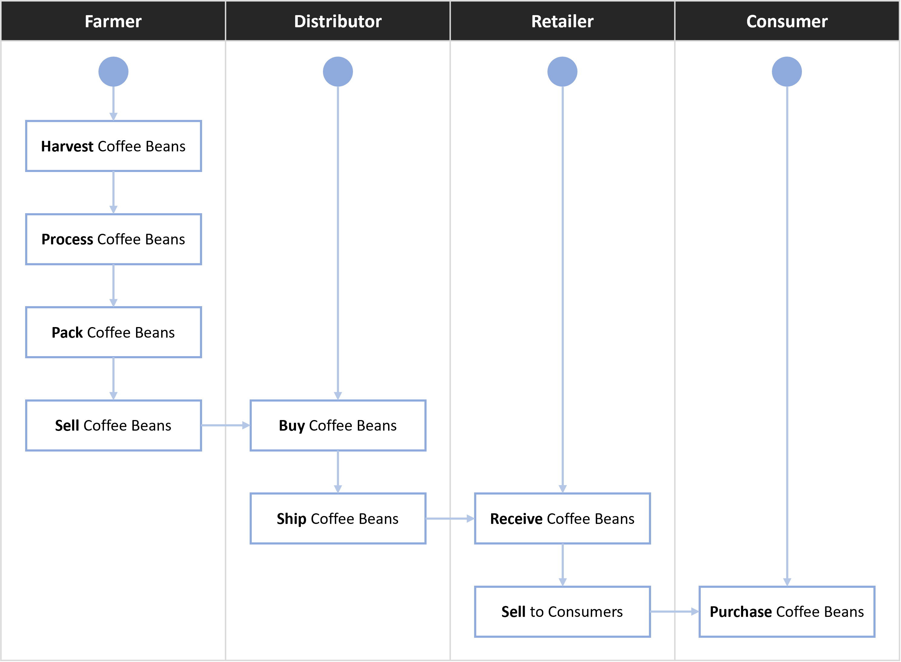
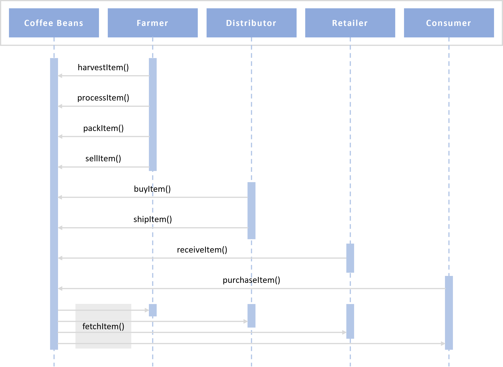
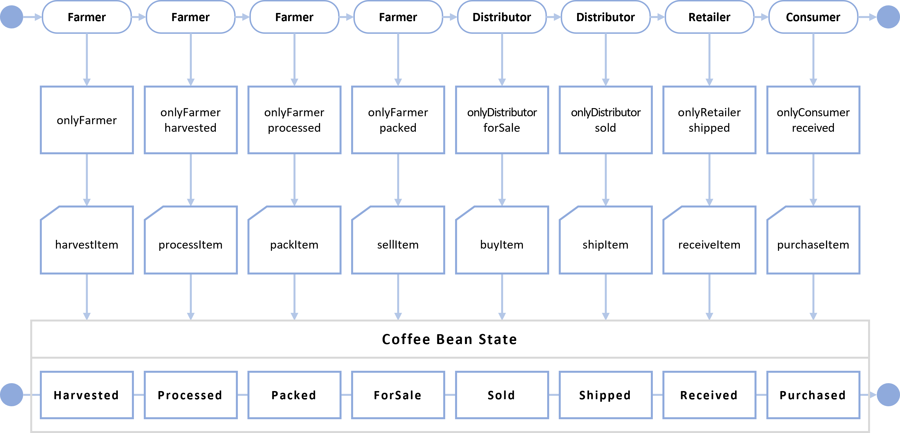
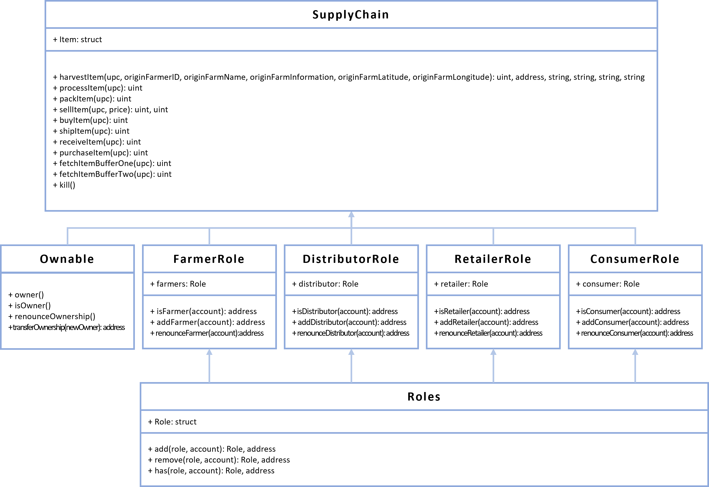

# Udacity Project 3 - Coffee Supplychain - Write-Up

The following write-up covers the Coffe Supplychain DApp and it's components, include:
* UML Diagrams:
  * Activity
  * Sequence
  * State
  * Classes (Data Model)
* Libraries Used
* General Write Up
  * Environment
  * Deployed Contract Address
* References

## UML Diagrams
### Activity Diagram:



### Sequence Diagram:



### State Diagram:



### Classes (Data Model) Diagram:



## Libraries Used
### Roles
* Roles - Library for managing addresses assigned to a Role

## General Write
### Environment Details:
* Node: v14.17.3
* Truffle: v4.1.14
* Web3: v6.14.13
* truffle-assertions: v0.9.2

### Rinkeby Deployed Contract Details:
Tx Hash:
```
0xc353df3858be840ad284573ec24de2cde4977e671d17d05ffe09d34815099500
```

Contract Address:
```
0xa878803bb73e92349eae6178a04ed653c38c9c67
```

### Notes:
* IPFS was not used in this project (optional)
* Refer to ReadMe.md file for instructions in Getting Started to run the DApp

## References
### Built With:

* [Ethereum](https://www.ethereum.org/) - Ethereum is a decentralized platform that runs smart contracts
* [Truffle Framework](http://truffleframework.com/) - Truffle is the most popular development framework for Ethereum with a mission to make your life a whole lot easier.

### Authors:

* Kevin Li Chan
* Udacity

### Acknowledgments:

* Udacity
* Solidity
* Ganache-cli
* Truffle
